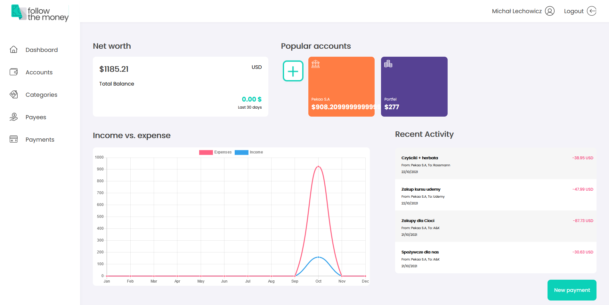

# Follow the money
> There is an application for controlling your money. 
> Live demo [_server_](https://ftm-server-prod.up.railway.app).
> Live demo [_client_](https://ichal6.github.io/Follow-the-money-Client).

## Table of Contents
* [General Info](#general-information)
* [Technologies Used](#technologies-used)
* [Features](#features)
* [Screenshots](#screenshots)
* [Setup](#setup)
* [Project Status](#project-status)
* [Room for Improvement](#room-for-improvement)
* [Acknowledgements](#acknowledgements)
* [Contact](#contact)
* [Source for Readme file](#Source-for-Readme-file)
<!-- * [License](#license) -->


## General Information
- This project use for controlling spend money. 
- In this application you can add categories, payments, accounts, payees.

## Technologies Used
Server side:
- Java - version 17
- Spring Boot
- Hibernate
- PostgreSQL

Client side:
- Angular


## Features
List the ready features:
- Dashboard view with summary of accounts
- Accounts CRUD
- Categories CRUD
- Subcategories CRUD
- Payees CRUD
- Payments Create, Read, Delete

List of improve:
- Edit payments
- Add transfers
- Add subcategories in payments
- Add Financial analysis


## Screenshots
### Dashboard view:


### Mobile view:


## Setup
1. Install Java 17
2. Install [PostgreSQL](https://www.postgresql.org/download/) 
3. Set up a new system environment: [tutorial for Windows](https://docs.oracle.com/en/database/oracle/machine-learning/oml4r/1.5.1/oread/creating-and-modifying-environment-variables-on-windows.html)
   1. FTM_DATASOURCE_URL -> the url address for database (default for localhost: **jdbc:postgresql://localhost:5432/postgres**)
   2. FTM_DATASOURCE_USERNAME -> the username, you should create it in database (default: **postgres**)
   3. FTM_DATASOURCE_PASSWORD -> password for user (set up when user was created)
   4. PORT -> select port for server (ex. 8080)
   5. FTM_SECRET -> secret for JWT (example from: [generator online](https://www.allkeysgenerator.com/random/security-encryption-key-generator.aspx)). 512-bit should be ok (now is year 2023)
   6. You should restart your system
   7. If you run server from jar file active profile:
      1. dev -> Drop all database and insert dump data, enable debug mode 
      2. prod -> enable security connection
      3. [none] -> run app ond efault port and only connect with db
   8. If you run app from jar file you have to disable MultiRelease -> [bug in Spring Boot](https://github.com/spring-projects/spring-boot/issues/33633):
   ```bash
   java -Djdk.util.jar.enableMultiRelease=false -jar -Dspring.profiles.active=dev
   ```
4. Now program should work

## Project Status
Project is: _in progress_ .


## Room for Improvement

- Repair bug in view
- Add payments edit
- Add transfer
- Include subcategories in payments
- Add migrate database
- Improve dashboard with loan subsection
- Add User settings
- Add notification


## Acknowledgements
- Many thanks to my mentors from Codecool
- And Karolina Budzik for cooperation and design


## Contact
Michał Lechowicz <br />
[LinkedIn](https://www.linkedin.com/in/micha%C5%82-lechowicz/)

### Source for Readme file
Created by [@flynerdpl](https://www.flynerd.pl/)


<!-- Optional -->
<!-- ## License -->
<!-- This project is open source and available under the [... License](). -->

<!-- You don't have to include all sections - just the one's relevant to your project -->
